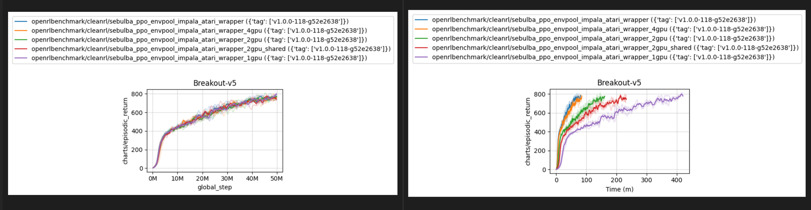
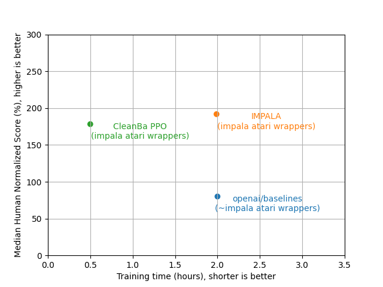
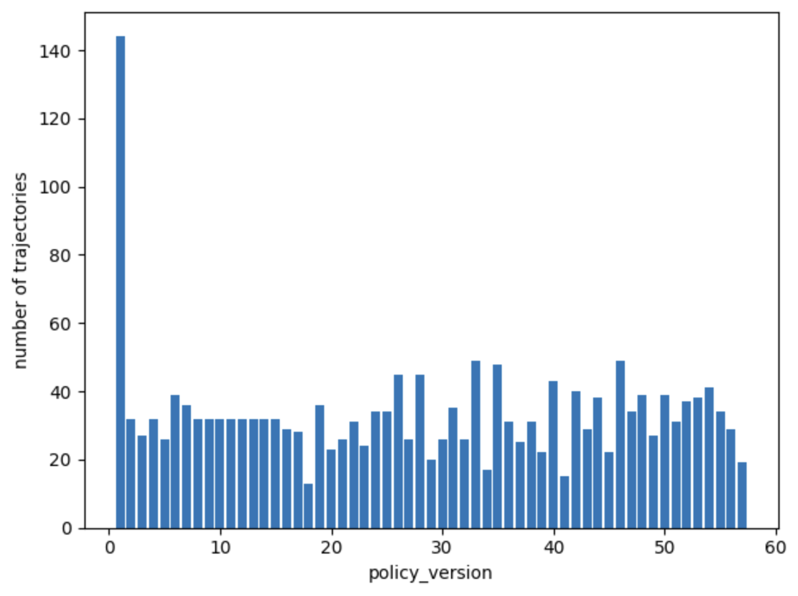
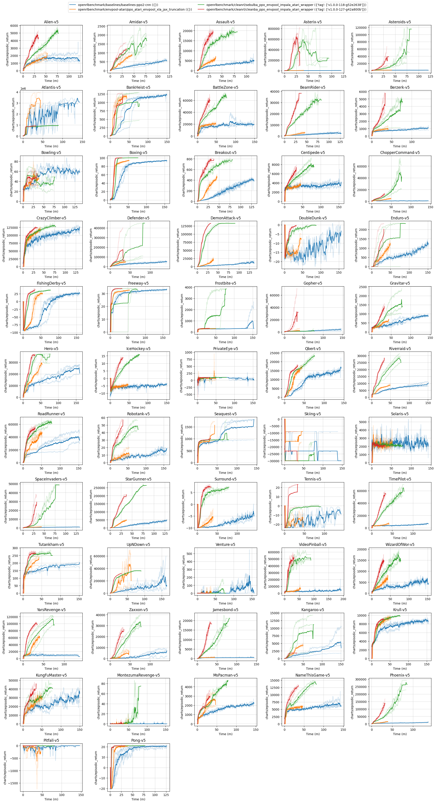
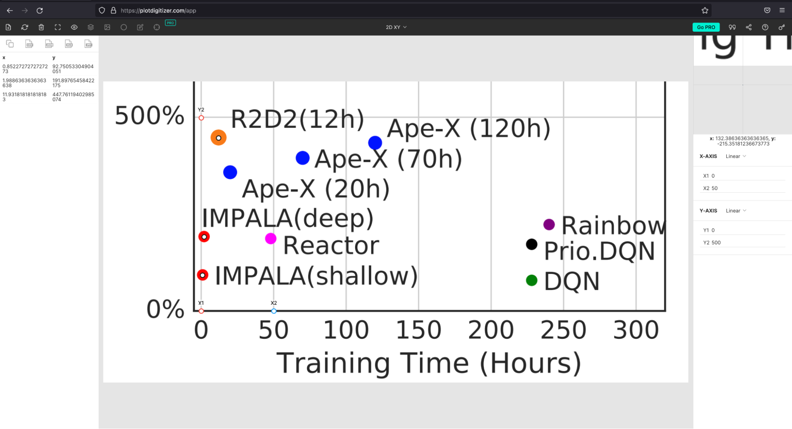

# Cleanba: A Reproducible, Efficient, Scalable, Distributed Deep Reinforcement Learning Framework

Cleanba is CleanRL's implementation of DeepMind's Sebulba distributed training framework, but with a few different design choices to make distributed RL more reproducible and transparent to use.

>**Warning** This repo is a **WIP** made public because it's easier for me to share pointers with collaborators. We are still working on the documentation, the codebase, and some internal development. Please feel free to open an issue if you have any questions or suggestions.

>**Warning** This repo is intended for archiving purposes. Once the codebase is stable, we will move it to [CleanRL](https://github.com/vwxyzjn/cleanrl) for future maintenance.

## Highlights


**Highly reproducible**: More GPUs only make things faster. You can always reproduce the same results with a single GPU.



**High-performing**: We can currently achieve 178.24% median human-normalized score across 57 Atari games in ~30 mins, with 8 GPUs (distributed 2 times on 4 GPUs). This is a 4x walltime speedup compared to the IMPALA ([Espeholt et al., 2018](https://arxiv.org/abs/1802.01561)) paper, and a 1.5x speedup compared to the original Sebulba ([Hessel et al., 2021](https://arxiv.org/pdf/2104.06272.pdf)) paper.



**Scalable**: We can scale to N+ GPUs allowed by `jax.distributed` and memory (e.g., it can run with 16 GPUs). This makes cleanba suited for large-scale distributed training tasks such as RLHF.

**Understandable**: We adopt the single-file implementation philosophy used in CleanRL, making our core codebase succinct and easy to understand. For example, our `cleanba/cleanba_ppo_envpool_impala_atari_wrapper.py` is ~800 lines of code.


## Get started

Prerequisites:
* Python >=3.8
* [Poetry 1.3.2+](https://python-poetry.org)


### Installation:
```
poetry install
poetry run pip install --upgrade "jax[cuda]==0.3.25" -f https://storage.googleapis.com/jax-releases/jax_cuda_releases.html
poetry run python cleanba/cleanba_ppo_envpool_impala_atari_wrapper.py
poetry run python cleanba/cleanba_ppo_envpool_impala_atari_wrapper.py --help
```

### Experiments:

Let us use `a0-l1,2,3-d1` to denote our setups, where `a0` means actor on GPU 0, `l1,2,3` means learner on GPUs 1,2,3, and `d1` means the computation is distributed 1 time.
Here are come common setups:

```
# a0-l0-d1: single GPU
python cleanba/cleanba_ppo_envpool_impala_atari_wrapper.py --actor-device-ids 0 --learner-device-ids 0 --track
# a0-l0,1-d1: two GPUs
python cleanba/cleanba_ppo_envpool_impala_atari_wrapper.py --actor-device-ids 0 --learner-device-ids 0 1 --track
# a0-l1,2-d1: three GPUs
python cleanba/cleanba_ppo_envpool_impala_atari_wrapper.py --actor-device-ids 0 --learner-device-ids 1 2 --track
# a0-l1,2,3-d1: four GPUs
python cleanba/cleanba_ppo_envpool_impala_atari_wrapper.py --actor-device-ids 0 --learner-device-ids 1 2 3 --track
# a0-l1,2,3,4-d1: five GPUs
python cleanba/cleanba_ppo_envpool_impala_atari_wrapper.py --actor-device-ids 0 --learner-device-ids 1 2 3 4 --track
# a0-l1,2,3,4,5,6-d1: seven GPUs
python cleanba/cleanba_ppo_envpool_impala_atari_wrapper.py --actor-device-ids 0 --learner-device-ids 1 2 3 4 5 6 --track

# a0-l0-d2: 8 GPUs (distributed 2 times on 4 GPUs)
# execute them in separate terminals; here we assume all 8 GPUs are on the same machine
# however it is possible to scale to hundreds of GPUs allowed by `jax.distributed`
CUDA_VISIBLE_DEVICES="0,1,2,3" SLURM_JOB_ID=26017 SLURM_STEP_NODELIST=localhost SLURM_NTASKS=2 SLURM_PROCID=0 SLURM_LOCALID=0 SLURM_STEP_NUM_NODES=2 python cleanba/cleanba_ppo_envpool_impala_atari_wrapper.py --distributed --actor-device-ids 0 --learner-device-ids 1 2 3
CUDA_VISIBLE_DEVICES="4,5,6,7" SLURM_JOB_ID=26017 SLURM_STEP_NODELIST=localhost SLURM_NTASKS=2 SLURM_PROCID=1 SLURM_LOCALID=0 SLURM_STEP_NUM_NODES=2 python cleanba/cleanba_ppo_envpool_impala_atari_wrapper.py --distributed --actor-device-ids 0 --learner-device-ids 1 2 3

# if you have slurm it's possible to run the following
python -m cleanrl_utils.benchmark \
    --env-ids Breakout-v5 \
    --command "poetry run python cleanrl/cleanba_ppo_envpool_impala_atari_wrapper_large.py --distributed --learner-device-ids 1 2 3 --track --save-model --upload-model" \
    --num-seeds 1 \
    --workers 1 \
    --slurm-gpus-per-task 4 \
    --slurm-ntasks 2 \
    --slurm-nodes 1 \
    --slurm-template-path cleanba.slurm_template
```

## Issues with distributed DRL

Distributed RL always seems a bit unreproducible to me. The typical idea is to create an actor-learner setup, where the actor collects data and the learner updates the model. 

One issue is that the actor and learner may run at different speeds, which would cause stale data / policy and make the training unstable. Also, the level of staleness could be different depending on many factors, such as the number of GPUs, the number of actors, the number of environments per actor, the speed of the inference / environment steps, etc.

For example, the following charts shows that in `torchbeast`, different policies genereated different numbers of trajectories. While in my testing this did not lead to different empirical results (which is a relief), it is still a bit concerning because algorithmically it's hard to reason about "what polciies are used to generate the training data" — one policy may generate more data than the other.



## How does Cleanba work?

Cleanba addresses the reproducibility issue by making ensuring the actor's policy version is always **exactly one step behind the learner's policy version**. The idea is similar to [HTS-RL](https://arxiv.org/abs/2006.14471), but the executions are completely different.

Here is a pseudo-code of Cleanba's core idea:


```python
rollout_queue = Queue.queue(len=1)
param_queue = Queue.queue(len=1)

def actor():
    for iteration in range(1, num_iterations):
        if iteration != 2:
            params = param_queue.get()
        data = rollout(params)
        rollout_queue.put(data)

def learner():
    for iteration in range(1, num_iterations):
        data = rollout_queue.get()
        agent.learn(data)
        param_queue.put(agent.param)

agent = Agent()
param_queue.put(agent.param)
threading.thread(actor).start()
threading.thread(learner).start()
```


Notice that the `iteration != 2` ensures actor is exactly 1 policy behind learner's latest policy.


Let us use `pi` to denote policy of version `i`, `di` the rollout data of version `i`. Then we have

```
 iteration: 1       2       3 
 actor:     p1->d1  p1->d2  p2->d3
 learner:           d1->p2  d2->p3
```

In the second iteration, we skipped the `param_queue.get()` call, so `p1->d2` happens concurrently with `d1->p2`. Because `get()` and `put()` operations are blocking and we have the queue sizes to be 1, we made sure actor's policy version is exactly 1 version preceding the learner's policy version.

To improve efficiency of Cleanba, we uses JAX and EnvPool, both of which are designed to be efficient. To improve scalability, we allow using multiple learner devices via `pmap` and use `jax.distibuted` to distribute to N-machines.


## Detailed performance



## Where is the number coming from?

[Espeholt et al., 2018](https://arxiv.org/abs/1802.01561) did not disclose the hardware usage and runtime for the Atari experiments. We did our best to recover its runtime by interpolating the results from the [R2D2 paper](https://openreview.net/pdf?id=r1lyTjAqYX) and found IMPALA (deep) takes ~2 hours.



## Acknowledgements

We thank [Stability AI's HPC](https://github.com/Stability-AI/stability-hpc) for generously providing the computational resources for this project.
