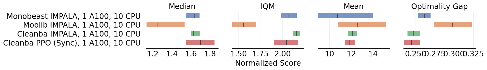
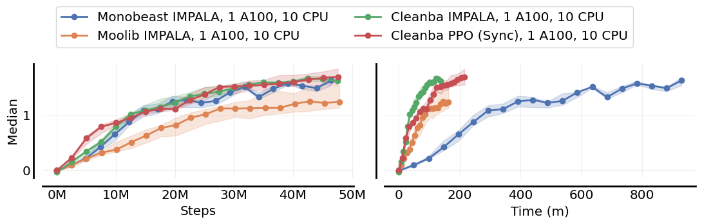
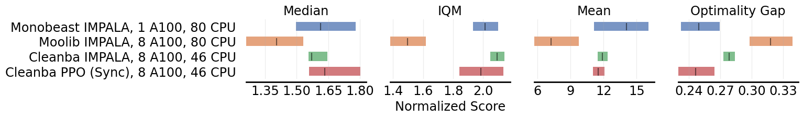
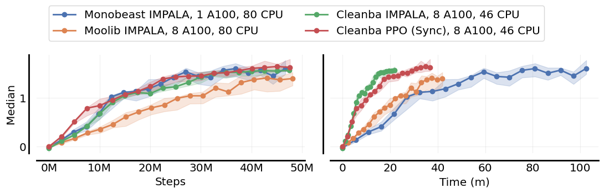
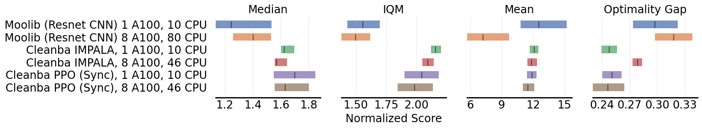
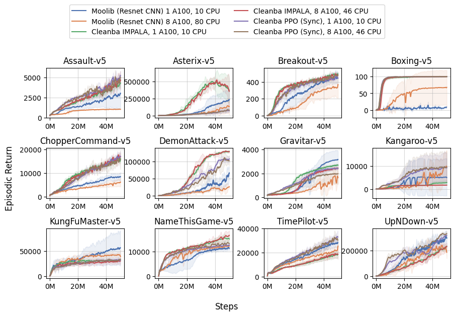

# Cleanba: A Reproducible and Efficient Distributed Reinforcement Learning Platform

### <a href="https://arxiv.org/abs/2310.00036" target="_blank">[Paper]</a> 

Cleanba is **Clean**RL-style implementation of DeepMind's Sebul**ba** distributed training platform, but with a few different design choices to make distributed RL more reproducible and transparent to use.


>**Warning** This repo is intended for archiving purposes. Once the codebase is stable, we will move it to [CleanRL](https://github.com/vwxyzjn/cleanrl) for future maintenance.


## Highlights

1. **Strong performance**: Cleanba's IMPALA and PPO achieve about 165% median HNS in Atari with sticky actions, matching `monobeast` IMPALA's 165% median HNS and outperforming `moolib` IMPALA's 140% median HNS.
2. **Short training time**: Under the 1 GPU 10 CPU setting, Cleanba's IMPALA is **6.8x faster**  `monobeast`'s IMPALA and **1.2x faster** than `moolib`'s IMPALA. Under a max specification setting, Cleanba's IMPALA (8 GPU and 40 CPU) and **2x faster** than `moolib`'s IMPALA (8 GPU and 80 CPU) is **5x faster** than `monobeast`'s IMPALA (1 GPU and 80 CPU).




3. **Highly reproducible**: Cleanba shows predictable and reproducible learning curves across 1 and 8 GPU settings given the same set of hyperparameters, whereas `moolib`'s learning curves can be considerably different, even if hyperparameters are controlled to be the same.




**Understandable**: We adopt the single-file implementation philosophy used in CleanRL, making our core codebase succinct and easy to understand. For example, our `cleanba/cleanba_ppo.py` is ~800 lines of code.


## Get started

Prerequisites:
* Python >=3.8
* [Poetry 1.3.2+](https://python-poetry.org)
* CUDA 11.2+
* CuDNN 8.2+


### Installation:
```
poetry install
poetry run pip install --upgrade "jax[cuda11_cudnn82]==0.4.8" -f https://storage.googleapis.com/jax-releases/jax_cuda_releases.html
poetry run python cleanba/cleanba_ppo.py
poetry run python cleanba/cleanba_ppo.py --help
```

### Experiments:

Let us use `a0-l1,2,3-d1` to denote our setups, where `a0` means actor on GPU 0, `l1,2,3` means learner on GPUs 1,2,3, and `d1` means the computation is distributed 1 time.
Here are come common setups. You can also run the commands with `--track` to track the experiments with [Weights & Biases](https://wandb.ai/).

```
# a0-l0-d1: single GPU
python cleanba/cleanba_ppo.py --actor-device-ids 0 --learner-device-ids 0 --local-num-envs 60 --track
# a0-l0,1-d1: two GPUs
python cleanba/cleanba_ppo.py --actor-device-ids 0 --learner-device-ids 0 1 --local-num-envs 60
# a0-l1,2-d1: three GPUs
python cleanba/cleanba_ppo.py --actor-device-ids 0 --learner-device-ids 1 2 --local-num-envs 60
# a0-l1,2,3-d1: four GPUs
python cleanba/cleanba_ppo.py --actor-device-ids 0 --learner-device-ids 1 2 3
# a0-l1,2,3,4-d1: five GPUs
python cleanba/cleanba_ppo.py --actor-device-ids 0 --learner-device-ids 1 2 3 4 --local-num-envs 60
# a0-l1,2,3,4,5,6-d1: seven GPUs
python cleanba/cleanba_ppo.py --actor-device-ids 0 --learner-device-ids 1 2 3 4 5 6 --local-num-envs 60

# a0-l0-d2: 8 GPUs (distributed 2 times on 4 GPUs)
# execute them in separate terminals; here we assume all 8 GPUs are on the same machine
# however it is possible to scale to hundreds of GPUs allowed by `jax.distributed`
CUDA_VISIBLE_DEVICES="0,1,2,3" SLURM_JOB_ID=26017 SLURM_STEP_NODELIST=localhost SLURM_NTASKS=2 SLURM_PROCID=0 SLURM_LOCALID=0 SLURM_STEP_NUM_NODES=2 python cleanba/cleanba_ppo.py --distributed --actor-device-ids 0 --learner-device-ids 1 2 3 --local-num-envs 60
CUDA_VISIBLE_DEVICES="4,5,6,7" SLURM_JOB_ID=26017 SLURM_STEP_NODELIST=localhost SLURM_NTASKS=2 SLURM_PROCID=1 SLURM_LOCALID=0 SLURM_STEP_NUM_NODES=2 python cleanba/cleanba_ppo.py --distributed --actor-device-ids 0 --learner-device-ids 1 2 3 --local-num-envs 60

# if you have slurm it's possible to run the following
python -m cleanrl_utils.benchmark \
    --env-ids Breakout-v5 \
    --command "poetry run python cleanrl/cleanba_ppo.py --distributed --learner-device-ids 1 2 3 --local-num-envs 60 --track --save-model --upload-model" \
    --num-seeds 1 \
    --workers 1 \
    --slurm-gpus-per-task 4 \
    --slurm-ntasks 2 \
    --slurm-nodes 1 \
    --slurm-template-path cleanba.slurm_template
```


### Reproduction of all of our results.

Please see `benchmark.sh` for the commands to reproduce all of our results. 

The commands to reproduce the TPU experiments can be found in `tpu.sh`. Here is a video demonstrating the orchestration of TPU experiments.

https://user-images.githubusercontent.com/5555347/227632573-137e4d72-4a31-4a06-b9e5-784abebe6c2b.mov

Using an **earlier version** of the codebase, here are some runtime numbers for different hardware settings (GPUs TPUs).


|             | runtime (minutes) in `Breakout-v5` |
|:------------|------------:|
| baseline (8 A100) | 30.4671 |
| a0_l0_d1 (1 A100) | 154.079 |
| a0_l0_d2 (2 A100) | 93.3155 |
| a0_l1_d1 (2 A100) | 121.107 |
| a0_l01_d1 (2 A100) | 101.63 |
| a0_l1 2_d1 (3 A100) | 70.2993 |
| a0_l1 2 3_d1 (4 A100) | 52.5321 |
| a0_l0_d4 (4 A100) | 58.4344 |
| a0_l1 2 3 4_d1 (5 A100) | 44.8671 |
| a0_l1 2 3 4 5 6_d1 (7 A100) | 38.4216 |
| a0_l1 2 3 4 5 6_d1 (7 TPUv3-8 cores) | 124.397 |
| a0_l1 2_d1 (6 TPUv4 cores ) | 44.4206 |
| a0_l1_d1 (4 TPUv4 cores) | 54.6161 |
| a0_l1_d2 (8 TPUv4 cores) | 33.1134 |


## Detailed performance

The complete learning curves can be found in the `static/cleanba` folder. `static/cleanba/plot.sh` contains the plotting script.


## Pseudocode 

```python
import queue
import threading

class Agent():
    def __init__(self):
        self.param = 1

    def learn(self, data):
        self.param += 1

ITER = 7
batch_size = 32
agent = Agent()
data_Q = queue.Queue(maxsize=1)
param_Q = queue.Queue(maxsize=1)
def actor():
    for i in range(1, ITER):
        if i != 2:
            params = param_Q.get()
            print(f"[actor] get π_{params}")
        data = params
        data_Q.put(data)
        print(f"[actor] put π_{params} -> D_π_{data}")

actor_thread = threading.Thread(target=actor)
actor_thread.start()

# initial param put
param_Q.put(agent.param)

# cleanba style stuff
for _ in range(1, ITER - 1):
    data = data_Q.get()
    print(f"[leaner] get D_π_{data}")
    old_param = agent.param
    agent.learn(data)
    param_Q.put(agent.param)
    print(f"[leaner] get π_{old_param} -> D_π_{data} -> π_{agent.param}")
actor_thread.join()
```
```
[actor] get π_1
[actor] put π_1 -> D_π_1
[leaner] get D_π_1
[actor] put π_1 -> D_π_1
[leaner] get π_1 -> D_π_1 -> π_2
[actor] get π_2
[leaner] get D_π_1
[actor] put π_2 -> D_π_2
[leaner] get π_2 -> D_π_1 -> π_3
[actor] get π_3
[leaner] get D_π_2
[actor] put π_3 -> D_π_3
[leaner] get π_3 -> D_π_2 -> π_4
[actor] get π_4
[leaner] get D_π_3
[actor] put π_4 -> D_π_4
[leaner] get π_4 -> D_π_3 -> π_5
[actor] get π_5
[leaner] get D_π_4
[actor] put π_5 -> D_π_5
[leaner] get π_5 -> D_π_4 -> π_6
```

## Acknowledgements

We thank 

* [Stability AI's HPC](https://github.com/Stability-AI/stability-hpc) for generously providing much GPU computational resources to this project.
* [Hugging Face](https://huggingface.co/)'s cluster for providing much GPU computational resources to this project.
* [Google's TPU Research Cloud](https://sites.research.google/trc/about/) for providing the TPU computational resources.


## Citation

```bibtex
@misc{huang2023cleanba,
      title={Cleanba: A Reproducible and Efficient Distributed Reinforcement Learning Platform}, 
      author={Shengyi Huang and Jiayi Weng and Rujikorn Charakorn and Min Lin and Zhongwen Xu and Santiago Ontañón},
      year={2023},
      eprint={2310.00036},
      archivePrefix={arXiv},
      primaryClass={cs.LG}
}
```
